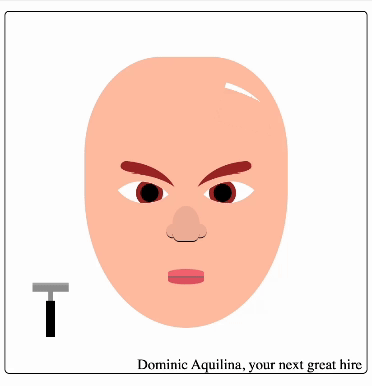

# The Shavening

## Description

A simple Angular program as a fun project for submission to the Structure Studios technical assessment

## How to run this example

### Installation

Call `npm install` to install all necessary dependencies.

### Development

To start local development server call `npm run start`. Now you can visit http://localhost:8080 to view this project.
